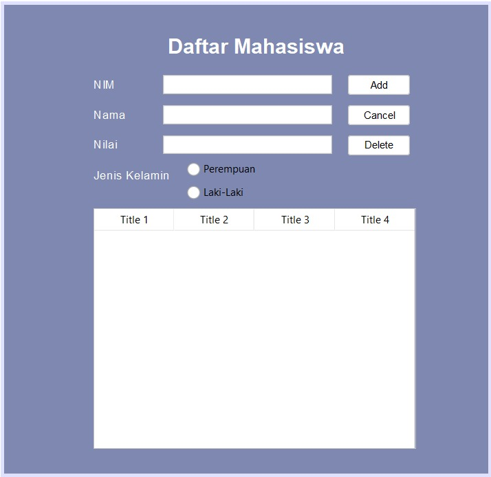
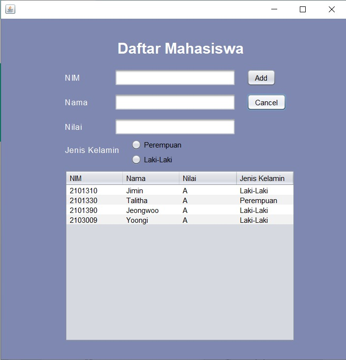
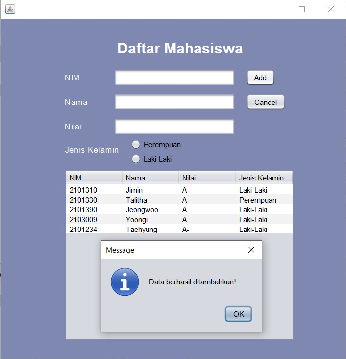
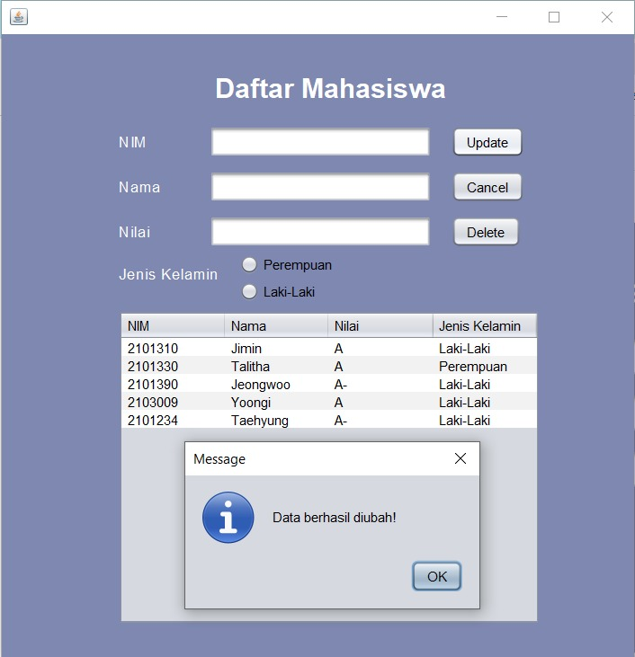
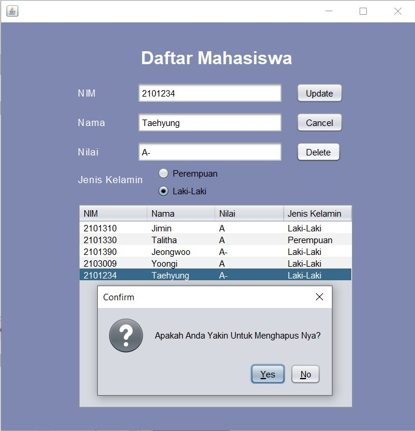
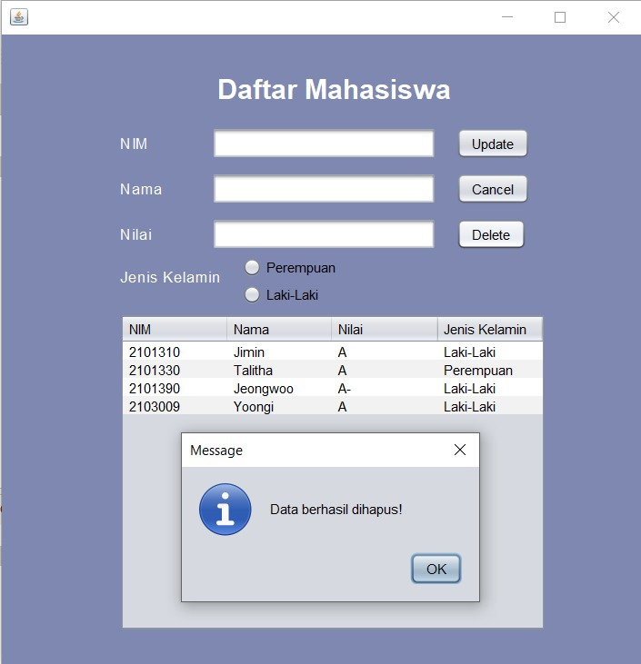

## Janji
Saya Talitha Syahla NIM 2101330 mengerjakan
Soal Latihan 5 dalam mata kuliah Desain Pemrograman Berorientasi Objek untuk keberkahanNya maka saya tidak melakukan 
kecurangan seperti yang telah dispesifikasikan. Aamiin.

# TUGAS LATIHAN 5 DPBO 2023
- Add more property (component type: any, except text field)
- Add method to reset form
- Refresh table after update and delete
- Add confirmation prompt before delete
- Build project (generate .jar file)

File README ini berisikan design program, penjelasan alur program, dan dokumentasi saat program dirun/dijalankan.

# Design Program
Design pada program disini menggunakan 2 Class, dengan 1 Class utama yaitu `Class Mahasiswa` :

1) `Class Mahasiswa`, Class ini memiliki atribut :
    - nim berupa `string`
    - nama berupa `string`
    - nilai berupa `string`
    - gender berupa `string`

Class ini memiliki setter dan getter di dalamnya.

2) `Class Menu`, Class ini berisikan method-method seperti :
    - `setTabel` untuk mengatur tabel yang akan ditampilkan (_DefaultTableModel_)
    - `insertData` untuk menambahkan data mahasiswa (_void_)
    - `updateData` untuk mengubah data mahasiswa yang dipilih user (_void_)
    - `deleteData` untuk menghapus data mahasiswa yang dipilih user (_void_)
    - `resetForm` untuk mereset tampilan form mejadi default (_void_)

# Design GUI

# Alur Program
Pada program ini, terdapat 3 textfield yang dapat digunakan oleh user untuk mengisi NIM, Nama, dan Nilai. Selain itu juga terdapat RadioButton yang dapat pilih oleh user untuk diisi mengenai Jenis Kelamin nya.

Jika user sudah mengisikan data dirinya pada form tersebut, user dapat klik tombol `Add` dan secara otomatis data yang diisi user akan ditambahkan dan ditampilkan pada tabel yang ada. Data-data yang diisi user pada field juga otomatis akan ter-reset apabila user klik tombol `Add`.

User juga dapat mengubah data-data yang ada pada tabel. User dapat memilih baris data yang ingin diubah, lalu field akan otomatis terisi berdasarkan baris data yang user pilih, data dapat langsung diubah pada textfield. Jika sudah diubah maka dapat klik tombol `Update` dan secara otomatis field akan ter-reset kembali seperti default dan juga tabel data yang diubah akan menampilkan data dengan data yang baru diubah.

Selain dapat menambahkan dan mengubah data, user juga dapat menghapus data berdasarkan baris data yang ingin dihapus. Jika sudah dipilih, klik tombol `Delete` lalu akan ada tampilan berupa konfirmasi apakah user yakin untuk menghapus data tersebut atau tidak. Jika user yakin untuk menghapusnya, maka dapat memilih opsi _`yes`_ dan data akan secara otomatis terhapus. Field pada form akan ter-reset kembali seperti default.

Menu tambahan yaitu `Cancel`, jika user menekan tombol ini maka data-data yang ada di textfield akan ter-reset secara otomatis.

# Dokumentasi

### Jar File

### Insert Data

### Update Data

### Delete Data

*Menampilkan pop up confirmation*

*Jika option yang dipilih `yes`, data akan terhapus*

